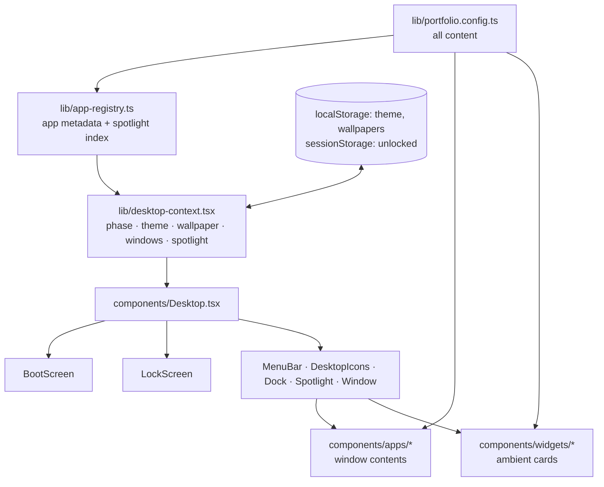

<div align="center">

# Portfolio OS

**A portfolio that boots.**

An interactive résumé disguised as a desktop operating system — power-on sequence, login screen,
menu bar, magnifying dock, live widgets, Spotlight search, a working terminal, and draggable
windows. Every "app" is a section of the portfolio instead of a page of a website.

[](https://nextjs.org)
[](https://react.dev)
[](https://www.typescriptlang.org)
[](#design-notes)
[](#zero-dependency-by-design)
[](LICENSE)

</div>

```
┌───────────────────────────────────────────────────────────────────────┐
│    File  Edit  View  Window  Help                ⌁ ▤ ◐  Tue 14:32  │ ← menu bar
├───────────────────────────────────────────────────────────────────────┤
│                                                                       │
│   ▢ About Me                                        ┌──────────────┐  │
│   ▢ Projects         ┌──────────────────────────┐   │   🕐 clock   │  │
│   ▢ Skills           │ ● ● ●     Terminal       │   ├──────────────┤  │
│   ▢ Terminal         │                          │   │  ☀ weather   │  │
│   ▢ Resume           │ satya@portfolio ~ $ open │   ├──────────────┤  │
│   ▢ Journal          │ projects_                │   │  ▦ calendar  │  │
│   ▢ Contact          │                          │   ├──────────────┤  │
│   ▢ Settings         └──────────────────────────┘   │  ♪ playing   │  │
│                                                     └──────────────┘  │
│                    ▁ ▂ ▃ ▅ ▇ ▅ ▃ ▂ ▁   ← magnifying dock              │
└───────────────────────────────────────────────────────────────────────┘
```

<!-- Swap the sketch above for the real thing: save a screenshot to docs/screenshot.png
     and uncomment the line below.
<p align="center"></p>
-->

---

## Contents

- [Quick start](#quick-start)
- [What's in the box](#whats-in-the-box)
- [Keyboard reference](#keyboard-reference)
- [The terminal](#the-terminal)
- [Make it yours](#make-it-yours)
- [Before you deploy](#before-you-deploy)
- [Project structure](#project-structure)
- [How it works](#how-it-works)
- [Design notes](#design-notes)
- [Deploying](#deploying)
- [Troubleshooting](#troubleshooting)
- [License](#license)

---

## Quick start

```bash
npm install
npm run dev          # http://localhost:3000
```

| Script | What it does |
| --- | --- |
| `npm run dev` | Development server with hot reload |
| `npm run build` | Production build |
| `npm start` | Serve the production build (run `build` first) |
| `npx tsc --noEmit` | Type-check the whole project without emitting |

**Requires Node 20.9 or newer** — that's the floor set by Next 16. There is nothing else to
install and no environment variables to set: no API keys, no database, no `.env` file. The site is
entirely self-contained.

---

## What's in the box

### Eight windowed apps

Each one opens as a real window you can drag, resize, zoom, minimize and close. All eight appear
both as desktop icons and in the dock.

| App | Window title | What's inside |
| --- | --- | --- |
| 👤 **About** | About Me | Long-form bio, quick facts, a "currently" list |
| 📁 **Projects** | Projects | Sidebar of projects with stack, highlights and links |
| ✨ **Skills** | Skills | Four skill groups rendered as levelled bars |
| ▪ **Terminal** | Terminal | 20 working commands — see [below](#the-terminal) |
| 📄 **Resume** | Resume.pdf | A full résumé sheet with a print-to-PDF button |
| 📝 **Journal** | Journal | Long-form notes and essays |
| ✉ **Contact** | Contact | Email plus social links |
| ⚙ **Settings** | System Settings | Theme, wallpaper picker, shortcut reference |

### Four desktop widgets

An analog SVG clock (60 hand-drawn tick marks, an orange second hand, and your timezone) that
ticks once a second. A weather card — static by design, no API key and no network call, though it
does swap a Day/Night label based on the real hour. A month calendar that highlights today and
lets you page backwards and forwards. And a Now Playing card that simulates playback with a
moving progress bar and track rollover; it's theatre, not audio — the project ships no sound files.

### The full boot sequence

Load the page and you get a progress bar climbing through five stages — *Loading kernel modules*,
*Mounting /Users/portfolio*, *Starting window server*, *Restoring session*, *Ready* — then a lock
screen. Any password works, including an empty one; the hint says so. There's a **Skip** button
for people who've seen it.

The sequence only plays once per browser tab. It's recorded in `sessionStorage`, so refreshing
while you work drops you straight back onto the desktop. *Restart* and *Lock Screen* in the brand
menu replay it on demand.

### Spotlight

`⌘K` or `⌘Space` opens a search field that indexes every app, every project, and two actions
(*Toggle Appearance*, *Lock Screen*). Project results deep-link: selecting one opens the Projects
window already focused on that record. Results are keyboard-navigable with `↑` `↓` `↵`.

### Light and dark, with wallpapers

The sun/moon button in the menu bar toggles appearance. System Settings adds a wallpaper picker
with three gradients per theme — Seaside, Blossom, Dune for light; Midnight, Aurora, Graphite for
dark. All six are layered CSS gradients; there isn't a single image file in the repository.

Both choices persist in `localStorage`, and **each theme remembers its own wallpaper**
independently. An inline script in `app/layout.tsx` applies the stored theme before first paint,
so there's no flash of the wrong palette on reload.

---

## Keyboard reference

| Keys | What happens |
| --- | --- |
| `⌘K` / `⌘Space` | Open or close Spotlight |
| `↑` `↓` `↵` | Move through Spotlight results and launch |
| `Esc` | Close Spotlight |
| `⌘W` | Close the front window |
| `⌘M` | Minimize the front window |
| `↵` / `Space` | Open the focused desktop icon |
| Double-click title bar | Zoom the window |

Inside the terminal:

| Keys | What happens |
| --- | --- |
| `↑` `↓` | Walk through command history |
| `Tab` | Complete the command — or its argument |
| `⌘L` / `Ctrl+L` | Clear the screen |

**`Ctrl` works everywhere `⌘` does**, so the whole thing is usable on Windows and Linux without
learning Mac muscle memory. Tab completion is argument-aware: it completes filenames after `cat`,
app names after `open`, project ids after `project`, and `light`/`dark`/`toggle` after `theme`.

Windows can be dragged by the title bar, resized from the right edge, bottom edge or corner grip,
and zoomed by double-clicking the title bar. Dragging is clamped so a window can never be thrown
somewhere you can't grab it again.

---

## The terminal

The terminal is the one place where the desktop metaphor stops being decoration. Its commands
drive the actual window manager and theme engine, so `open projects` genuinely opens the Projects
window and `theme dark` genuinely repaints the entire shell. The shell calls itself `psh`.

| Command | What it does |
| --- | --- |
| `help` | List every command |
| `about` | The long-form bio |
| `projects` | Table of every project with tagline and year |
| `project <id>` | Print one project **and open it in the Projects window** |
| `skills` | Skill levels drawn as `█░` bar charts |
| `experience` | Roles, companies, dates |
| `notes` | Table of journal entries |
| `contact` | Email and links, **then opens Contact** |
| `resume` | **Opens Resume.pdf in Preview** |
| `open <app>` | **Launch any app window** — also accepts `github` / `linkedin` |
| `theme <light\|dark\|toggle>` | **Repaint the shell** |
| `ls` | List the fake filesystem |
| `cat <file>` | Read one of the five fake files |
| `neofetch` | ASCII logo and a system summary |
| `whoami` | Handle, role, location |
| `date` | The real current date |
| `echo <text>` | Exactly what you'd expect |
| `sudo` | Refuses, politely, and logs the incident |
| `clear` | Empty the screen |
| `exit` | `logout`, then closes the window |

Commands are case-insensitive. The fake filesystem holds `about.txt`, `projects.md`,
`skills.json`, `resume.pdf` and `contact.txt` — and they're not canned strings: `skills.json` is
real `JSON.stringify` output over the config, and `cat resume.pdf` tells you it's a binary file
and opens it in Preview instead.

---

## Make it yours

**Everything you'd want to change lives in one file: [`lib/portfolio.config.ts`](lib/portfolio.config.ts).**
Nothing else needs editing. Replace what's in there and the whole desktop — windows, dock,
Spotlight index, terminal output, résumé, page title — updates itself.

It exports, in source order:

| Export | Holds |
| --- | --- |
| `profile` | `name`, `initials`, `role`, `location`, `timezone`, `available`, `availabilityNote`, `email`, `tagline`, `bio[]`, `facts[]`, `currently[]` |
| `socials` | Links with an icon key: `github`, `linkedin`, `mail`, `x` or `globe` |
| `projects` | The Projects app and the Spotlight project index |
| `skillGroups` | Named groups of `{ name, level }` where level is 0–100 |
| `experience` | Jobs with bullets, for the Resume app |
| `education`, `certifications` | Résumé tail sections |
| `notes` | Journal entries — `preview` for the list, `body[]` for the reader |
| `weather` | The weather widget's static values |
| `playlist` | Tracks for the Now Playing widget (`length` in seconds) |
| `wallpapers` | Gradients, tagged `mode: "light" \| "dark"` |
| `lockScreen` | The `greeting` and `hint` strings |

The types are strict, so if you delete a required field TypeScript will point straight at it.

### Three things worth knowing while you edit

**Project ids are public API.** Spotlight results and the terminal's `project <id>` command both
deep-link by id, so keep them short, lowercase and stable.

**`status` is a closed set.** Only `"Shipped"`, `"In progress"`, `"Archived"` and `"Experiment"`
are styled — the value becomes a CSS class, so anything else renders colourless.

**Wallpaper ids are stored, not indexes.** A wallpaper id written to `localStorage` is validated
against the `wallpapers` array on read, so renaming an id just falls back to the default rather
than breaking.

### Changing the apps themselves

Which apps exist, which appear on the desktop versus in the dock, their window and minimum sizes,
icon gradients, Spotlight keywords, and the decorative menu-bar titles are all declared as plain
data in [`lib/app-registry.ts`](lib/app-registry.ts). Adding an app means adding an entry there,
adding the `AppId`, and wiring the component in `components/apps/AppSurface.tsx`. Desktop
shortcuts that just open a URL instead of a window live in the same file, in `shortcuts`.

---

## Before you deploy

The persona is real but several links are still sample values. Worth a pass over:

- [ ] `socials` in `portfolio.config.ts` — `github.com`, `linkedin.com` and `example.com` are placeholders
- [ ] `shortcuts` in `app-registry.ts` — the desktop GitHub and LinkedIn tiles point at the bare domains
- [ ] `projects` — Atlas, Kettle, LedgerLite, Quill and Prism are sample entries, and their `links` point at `example.com`
- [ ] `experience`, `education`, `certifications` — sample history
- [ ] `notes` — three sample essays
- [ ] `weather.city` — currently `Bengaluru`, while `profile.location` says Bhubaneswar
- [ ] `package.json` lists `pnpm` under `dependencies`; it isn't imported anywhere and can be removed

---

## Project structure

```
.
├── app/
│   ├── layout.tsx           Metadata from config, viewport, pre-paint theme script
│   ├── page.tsx             Mounts the desktop
│   ├── globals.css          Design tokens, reset, shell chrome         (~1,060 lines)
│   └── desktop.css          Window chrome, widgets, app interiors      (~1,680 lines)
│
├── lib/
│   ├── portfolio.config.ts  ← ALL CONTENT LIVES HERE
│   ├── app-registry.ts      App metadata + Spotlight index builder (pure data)
│   ├── desktop-context.tsx  The "operating system": phase, theme, window manager
│   └── use-now.ts           SSR-safe ticking clock hook
│
├── components/
│   ├── Desktop.tsx          Phase router: boot → lock → desktop
│   ├── BootScreen.tsx       Progress bar, five stages, Skip button
│   ├── LockScreen.tsx       Greeting, clock, password field
│   ├── MenuBar.tsx          Brand menu, per-app menus, status icons, clock
│   ├── Dock.tsx             Magnification, running dots, tooltips
│   ├── DesktopIcons.tsx     Keyboard-navigable icon grid
│   ├── Window.tsx           Title bar, traffic lights, drag + resize grips
│   ├── Spotlight.tsx        Fuzzy search over the index
│   ├── Icon.tsx             Every icon in the project, as inline SVG
│   ├── widgets/             Clock · Weather · Calendar · Music
│   └── apps/                About · Projects · Skills · Terminal · Resume
│                            Journal · Contact · Settings · AppSurface
│
├── next.config.mjs          reactStrictMode: true
└── tsconfig.json            strict, with the @/* path alias
```

---

## How it works



`lib/desktop-context.tsx` is the operating system. It owns the boot phase (`"boot" | "lock" |
"desktop"`), the theme, the wallpaper per theme, the window manager, and Spotlight state, and
exposes all of it through a single `useDesktop()` hook.

Windows are plain state objects — `{ id, x, y, w, h, z, minimized, maximized, restore, focusId,
nonce }`. New windows cascade by 30×26 pixels on a six-step cycle and are clamped to fit narrow
viewports. The active window is *derived* (highest `z` among non-minimized) rather than stored, so
it can never disagree with the z-order.

### Four invariants that are easy to break

These are the things that bite if you start editing. Each one exists for a reason:

**The z-counter is a `ref`, not state.** `zRef` is incremented *outside* the state updater so
every updater stays pure. React StrictMode double-invokes updaters in development; a counter
incremented inside one would advance twice per click and drift.

**Anything showing the current time returns `null` until mounted.** `lib/use-now.ts` initializes
to `null` and only sets a real `Date` inside `useEffect`, which is what keeps server HTML and the
first client render identical. Reintroducing `new Date()` into a first render causes a hydration
mismatch. Consumers handle the null — the clock renders `—`, the weather falls back to hour 12.

**The dock measures tile positions only while at rest.** Never during render. A magnified tile
displaces its own neighbours, so measuring mid-animation feeds the magnification its own output.

**The music widget's rollover lives in a separate effect** from the tick, for the same StrictMode
purity reason as the z-counter.

### Storage keys

| Key | Where | Value |
| --- | --- | --- |
| `portfolio.theme` | localStorage | `"light"` or `"dark"` |
| `portfolio.wallpaper.light` | localStorage | Wallpaper id |
| `portfolio.wallpaper.dark` | localStorage | Wallpaper id |
| `portfolio.unlocked` | sessionStorage | `"1"` once past the lock screen |

All reads and writes go through helpers that swallow exceptions, so private browsing, a full quota
or a hostile iframe degrade to defaults instead of throwing. With nothing stored, the theme
follows `prefers-color-scheme`. Window positions and terminal history are deliberately not
persisted — the desktop is fresh every visit.

---

## Design notes

### Zero-dependency by design

The runtime dependency list is `next`, `react`, `react-dom`. That's it.

No UI library, no CSS framework, no icon package, no animation library, no image assets, no
webfonts. Every icon in the project is inline SVG in `components/Icon.tsx`. Every wallpaper is a
layered CSS gradient. Fonts are system stacks (`--font-ui`, `--font-mono`), so the page makes zero
network requests for anything decorative.

### Styling

Roughly 2,700 lines of hand-written CSS across two files, themed entirely through custom
properties on `:root[data-theme]` — `--surface`, `--surface-2`, `--text`, `--text-2`, `--border`,
`--hairline`, `--accent`, `--shadow-win`, `--tl-red`/`--tl-amber`/`--tl-green` and friends.
Switching theme rewrites one attribute; nothing re-renders to change colour.

### Accessibility and responsiveness

Traffic lights and the corner resize grip carry real ARIA labels naming their window. Desktop icons are
reachable and activatable from the keyboard. Minimized windows are `aria-hidden`. A global
`prefers-reduced-motion: reduce` rule collapses every animation and transition to 0.01ms.

Three breakpoints: at **1080px** the widget column steps aside, at **760px** the decorative menu
titles, status icons and dock tooltips drop out and the dock shrinks (the JS watches the same
760px line and drops the base dock tile from 52px to 42px), and at **620px** app sidebars and the
résumé sheet tighten up.

### Printing

Resume's "Print or save as PDF" button calls `window.print()` against a print stylesheet that
strips the entire desktop — menu bar, dock, widgets, icons, title bars, wallpaper — and un-clips
the résumé sheet so it flows across pages. It targets the résumé window with `:has()`, so browsers
without support fall back to printing everything rather than nothing.

---

## Deploying

It's a standard Next.js App Router project with no server-side data, so any Next host works with
no configuration. On [Vercel](https://vercel.com/new), import the repository and accept the
defaults.

For a static export, add `output: "export"` to `next.config.mjs` and run `npm run build` — the
site is entirely client-side, so nothing breaks. That makes GitHub Pages, Netlify, Cloudflare
Pages or any static bucket viable targets.

Once it's live, add the URL to the top of this README and to `socials`.

---

## Troubleshooting

**Blank page or a flash of the wrong theme.** Check that the inline theme script in
`app/layout.tsx` is intact and that `<html>` still has `suppressHydrationWarning`.

**Hydration mismatch after an edit.** Something is rendering the current time on the first pass.
Route it through `useNow()` and handle the `null`.

**A wallpaper won't stick.** The stored id is validated against the `wallpapers` array — if you
renamed an id, clear `portfolio.wallpaper.light` / `.dark` in localStorage.

**The boot sequence won't replay.** That's `sessionStorage`. Use *Restart* in the brand menu, open
a new tab, or clear `portfolio.unlocked`.

**`npm install` fails on an older Node.** Next 16 requires Node 20.9+.

---

## License

[MIT](LICENSE) — use it, fork it, ship your own. If you build your portfolio on it, a link back
is appreciated but not required.

The visual language is an homage to macOS. No Apple assets, fonts or code are included or
redistributed; every pixel here is CSS and inline SVG written from scratch.
